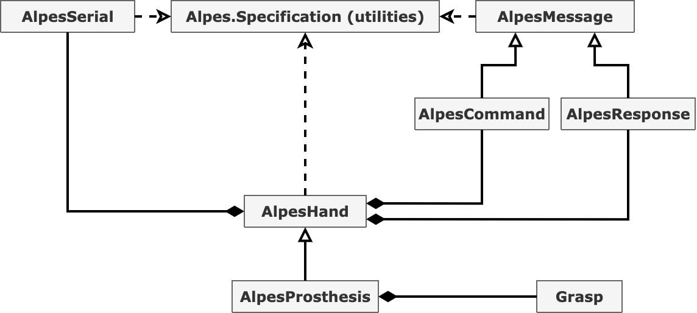

# Python interface for Alpes robotic hands

## Requirements and dependencies
Python 3 (tested on 3.8) with the following packages installed:
- _pyserial_ (tested with version _3.4_)
- _numpy_	   (tested with version _1.18.4_)

## Contents
Classes and constant structures (from low to high level):
- __AlpesSpecification.py__:    provides a bunch of constant structures that define alias for the hand registers, communication codes, etc.
- __AlpesSerial__:              a mere supplement for original pyserial module; can automatically detect serial ports that hands are connected to. 
- __AlpesProtocol__:            contains functions that transform the commands to correct binary packages, before sending them (class __AlpesMessage__). Also, parces the responses from the hand (class __AlpesResponse__). 
- __AlpesHand__:                low-level reading/writing instructions for the hand, initialisation, commands. 
- __AlpesProsthesis__:          high-level command instructions for the hand. Permits to perform discrete gestures, as well as proportional grasps.
	
__Note__: class diagram that illustrates the relationship between these classes is provided in *class\_diagram.xml* and *class\_diagram.png* files. Here is its shortened version:

<p align="center">
  
</p>

## Installation
Open command line, navigate to the folder with this project and run the following command:
```
pip3 install -e .
```

## Usage
Before using this code, please get familiar with the documentation files provided by the hand's developer.

Connect the hand to your PC using mini-usb cable, plug-in the hand's AC adapter. Ready to go.
### Bare bones
Very basic code that initialises the hand and the corresponding __AlpesProsthesis__ object:
```python
from Alpes.Specification import *
from Alpes.Prosthesis import AlpesProsthesis
h = AlpesProsthesis()
h.initialise()
```
If everything goes correctly, the hand will start the initialisation procedure. 
This procedure lasts about 30 seconds and is necessary if the hand was switched off before. 
If initialisation is finished successfully, you will see the message: 

`Hand initialised!` 

in your terminal. If something goes wrong, another message will appear: 

`Hand initialisation timeout (60 seconds) exceeded without the hand confirming the end of initialisation.`

It is hard to tell in advance, what could go wrong during initialisation since the author never experienced it. First thing to do would be to check if nothing blocks the motion of the fingers. Other than that ... It'd better not happen.

__Note__: If the hand was not switched off between the runs of this code, the  initialisation procedure will be automatically omitted to save time.

### Reading/writing hand's registers
To read a specific register, first, check it's name in __AlpesSpecification.py__ file. 
For example, if you want to know the parameters of the index finger's internal PID controller, read from __COEF\_P__, __COEF\_I__ and __COEF\_D__ registers of the corresponding channel:
```python
pid = [ h.read_register(VOIES.INDEX, REGISTRES.COEF_P),
        h.read_register(VOIES.INDEX, REGISTRES.COEF_I),
        h.read_register(VOIES.INDEX, REGISTRES.COEF_D) ]
```
This will read from the three specified registers in the motor of the INDEX finger, and put the result in a 3-element list __pid__.


To read a specific register for all motors of the hand, use the following method:
```python
mode = h.read_registers_across(REGISTRES.MODE_CMD_MOTEUR)
```
This will return a six-elements list of values contained in register __MODE\_CMD\_MOTEUR__ of all six motors. 


Writing to the registers is very similar to reading, except that you need to add data to the function call:
```python
h.write_register(VOIES.INDEX, REGISTRES.MODE_CMD_MOTEUR, 1)
h.write_registers_across(REGISTRES.MODE_CMD_MOTEUR, [0,0,0,1,1,1])
```
Where the last argument __data__ is the integer or a list of integers that you want to write into the register(s).

Finally, if you want to see the contents of all registers of a specific channel (middlefinger, in this example), you can use:
```python
h.read_memory()
print(h.memory[VOIES.MAJEUR])
```
This will list all the registers of this channel and their contents.

__Note:__ Backup images of the default memory are stored in __/misc/backup\_memory\_image__ in form of text files: one per motor channel.

### Reading motors' angular positions and velocities.
Each motor of the hand is equipped with a reduction gear (coefficient 1/256) and an encoder. 
The motors (model DCX10L EB KL 12V) rotate at high speed (hundreds of rad/s), which after reduction becomes what we actually observe.
Encoders have 32 counts per turn **before** the reduction, so that 32\*256 = 8192 is the number of counts for each turn after reduction.
In each motor, except for the thumb motors, rotation worth 43000 counts (or ~5 turns after reduction) completely folds the finger.
To obtain readings from the motor encoders, use __read\_positions()__ method:
```python
pos = h.read_positions() # Returns a six-element list
```
The hand's microcontroller constantly estimates the angular velocities of the motors by differentiation of their angles. 
To access these estimates, use:
```python
vel = h.read_velocities() # Returns a six-element list
```
Returned values are the angular velocities of the motor shafts measured in rpm (rotations per minute).

__Caveat__: unfortunately, microcontroller always return the absolute angular velocity, not taking into account the direction of the rotation. 
Logically, register __DIR\_MOTEUR\_CODEUR__, specified in the hand's documentation, should contain the direction of rotation (in it's first or second bit). 
However, we have read these bits and found out that they do not change in function of rotation of the motors. 
For those interested, we have left the corresponding method in AlpesHand (see __AlpesHand.read\_velocities\_and\_directions()__).
Thus, it seems like there is no way to query the hand for the directions and they should be derived from circumstances.


### Writing direct commands
Each motor has three accessible registers that affect its rotation:
- __REGISTRE.CONSIGNE\_TENSION\_POSITION__ when __REGISTRE.MODE\_CMD\_MOTEUR = 1__ allows to set an angular position of each motor that the internal PIDs will seek to reach.
- __REGISTRE.CONSIGNE\_TENSION\_POSITION__ when __REGISTRE.MODE\_CMD\_MOTEUR = 2__ allows to apply a specific voltage to each of the motors (between -11.5V and 11.5V).
- __REGISTRE.LIMITE\_COURANT__ allows to change the internal limit set on the motor current.

Access to these variables is wrapped in the following methods:
```python
h.write_positions([0, 0, 0, 0, 0, 0]) #Sets target angular position of all motors to 0 (unfold all fingers).
h.write_tensions([0, 0, 5, -5, 0, 0]) #Slowly folds the index and unfolds the middle finger.
h.set_current_limits([750, 750, 750, 750, 750, 750]) #Sets value of current limit (see the documentation and AlpesSpecification.py for more information).
```
Usage of __h.write\_positions()__ is harmless. This software checks and forbids erroneous requests. Default limit on of the position that may be requested is specified in __Alpes.Specification.MAXIMAL\_MOTOR\_POSITIONS__
Usage of __h.write\_tensions()__ may be harmful if done without proper attention. 
This software checks and forbids requests that exceed values specified in the documentation. 
However, when a finger is blocked by an object and a large torque is applied by the motor, its cable may break. 
This is not catastrophic, but replacing the cable may be tedious. 
Attempting to write values larger than 750 to the __REGISTRE.LIMITE\_COURANT__ will result in writing its maximum possible value, 750. 

### Gestures and proportional control
List of pre-programmed gestures can be found in __AlpesProsthesis.py__, class __GESTURES__. Each gesture is simply a list of final positions to be reached by the motors. Use the following method to perform gestures:
```python
import time
from Alpes.Prosthesis import AlpesProsthesis, GESTURES
h = AlpesProsthesis()
h.initialise()
h.set_gesture(GESTURES.VICTORY)
time.sleep(2) #Give the hand time to reach the final position before proceeding.
```
Or iterate through multiple gestures:
```python
for g in ["ONE", "TWO", "THREE", "FOUR", "FIVE"]:
    print('Performing %s gesture' % g)
    h.set_gesture(getattr(GESTURES(), g))
    time.sleep(2)
```

(UNDER REVISION)

Proportional control is a continuous version of setting a gesture. It makes the hand to perform a grasp up to a specific degree between 0 (no grasp) and 1 (maximal grasping force).
Available grasps are listed in __AlpesProsthesis.py__, class __GRASPS__ (see its comments for details). List can be extened.
To set up proportional control, run:
```python
from Alpes.Prosthesis import AlpesProsthesis, GRASPS
h = AlpesProsthesis()
h.initialise()
h.set_grasp(GRASPS.CYLINDRICAL)
```
and then, to perform the proportional control:
```python
N = 10
for t in range(N+1):
     h.proportional_control_current(t/N)
     time.sleep(0.2)
```

## Two-hands support
Here is the code that automatically finds both hands and initialises corresponding objects (hands should be both connected to the computer and powered):
```python
from Alpes.Prosthesis import AlpesProsthesis
hl, hr = AlpesProsthesis.two_hands()
```
This will create two instances of AlpesProsthesis class: __hl__ for the left hand and __hr__ for the right. 
Further work with each is similar to that with one hand.

## Working with MYO armband

## Relation with official Alpes' documentation
In the official documentation all the internal constants and register names are in French. 
Therefore, all variable names in __AlpesSpecification.py__ that were drawn from the documentation are in French, too, for consistence. 
All other elements or derivatives of the official names are in English. 

## What's next?
One can extend the provided classes the way he or she needs. 
The only suggestion is to not change the methods that are close to hardware, like reading/writing methods of __AlpesHand__. 
Low-level classes like __AlpesSerial__ and __AlpesProtocol__ should be handled with care and full understanding of your intentions.
__AlpesSerial__ has a global boolean __\_\_test\_\___ that you can assign to __True__ if you want to block communication with the hand for the purposes of testing the code. Hand's responses are replaced with generic test messages.
To implement new control approaches, inherit from __AlpesHand__ or __AlpesProsthesis__. 

## Acknowledgments
We would like to thank Alpes Industries for providing us with a detailed documentation on their product and for some after-purchase support.
Also, kind regards to Benjamin Gautier who was the first to write Matlab utilities for working with the hands.
Finally, we thank Guillaume Perrault for pythonification of the Benjamin's code, which helped a lot to write this code.

